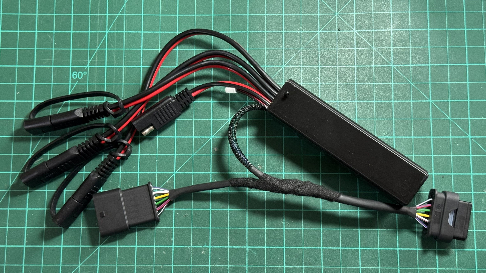
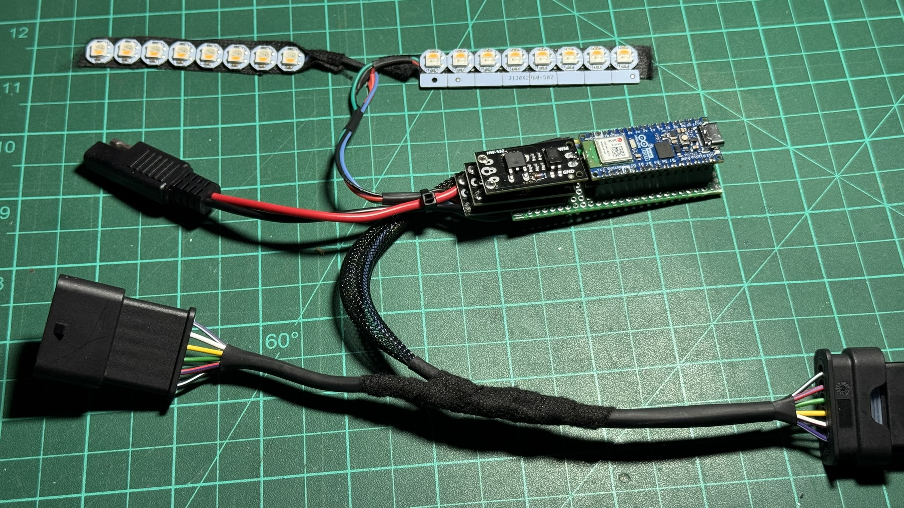
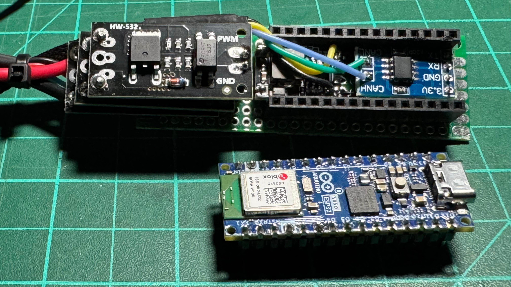
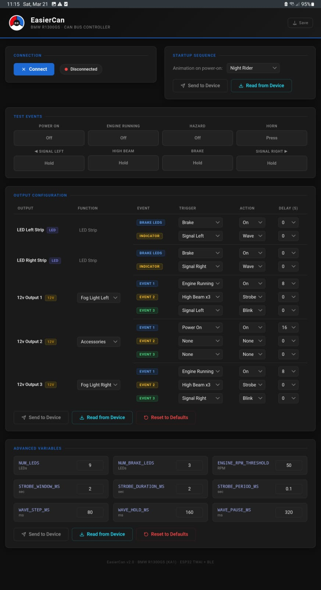

# BMW R1300GS Smart Backlight & Fog Light Controller — EasierCan v2.0

A fully custom, CAN-bus-integrated lighting controller for the BMW R1300GS motorcycle. Reads factory CAN bus signals directly from the XDWA connector to control rear LED strips, fog lights, and an air horn — no wire cutting or relay splicing into the original harness.

Fully configurable over Bluetooth using a mobile-friendly Web Bluetooth UI — no app install required.



---

## ✨ Features

### Lighting & Outputs
- **Configurable LED strips** — 9× SK6812 RGBW LEDs per side, split into independent brake zone (first N LEDs) and indicator zone (remaining LEDs)
- **Configurable MOSFET outputs** — 3× isolated 12V outputs for fog lights and air horn
- **Wave sequential turn signals** — indicator LEDs fill sequentially left-to-right in amber
- **Blink turn signals** — standard ~1.5 Hz amber flash (50% duty cycle)
- **Brake light** — brake zone shows dim red at idle, full bright red when braking
- **Strobe mode** — triggered by triple high-beam flash within a configurable window
- **Startup animations** — 10 selectable boot animations (Night Rider, Split/BMW Sweep, Converge & Explode, Heartbeat, Comet/Meteor, Stack/Tetris, Twinkle Fade-In, Thunder, Breathe/Pulse, Ping Pong)

### Configuration
- **BLE wireless configuration** — connect from Chrome on any phone or desktop, no app needed
- **Per-output triggers** — each output has two independent event slots (ev1 / ev2), each with its own trigger, action, and delay
- **Configurable actions** — None, On, Off, Strobe, Blink; plus Wave for LED strips
- **Configurable triggers** — Brake, Signal Left, Signal Right, High Beam, Engine Running, Power On, Hazard, High Beam ×3, Horn
- **Configurable delay** — action starts only after trigger has been active for N seconds
- **NVS persistence** — all settings survive power loss, stored in ESP32 flash
- **Auto-read on connect** — UI loads device config automatically when BLE connects

### Diagnostics
- **Test Events panel** — simulate any CAN signal from the UI without touching the bike
- **Serial diagnostics** — 2-second heartbeat via USB: CAN state, RPM, error counters, signal states
- **CAN bus isolated** — listen-only mode, never transmits to the bus

---

## 🧰 Bill of Materials

| # | Component | Notes |
|---|-----------|-------|
| 1 | Arduino Nano ESP32 | Main controller (ESP32-S3) |
| 1 | SN65HVD230 CAN Bus Transceiver | 3.3V logic, connects to XDWA |
| 1 | 872-861-501 6P OBD Connector (BMW/VW/MB) | Plugs into R1300GS XDWA port |
| 1 | DC-DC Buck Converter 5V–30V → 5V 3A | Powers Arduino + LEDs from 12V bike battery |
| 3 | LR7843 Isolated MOSFET Module (HW-532B) | Fog light left, fog light right, air horn |
| 18 | SK6812 RGBW LED (addressable) | 9 per side, rear tail/turn strip |
| 1 | Silicone Wire 22 AWG | All signal and power wiring |
| 3 | 3D Printed Parts | BackLightBody, BackLightRod, BackLightScreen |

---

## 📐 Wiring Diagram

### System Overview

```
BMW R1300GS XDWA Connector          Controller Box
  │
  ├── Pin 2  (Ground) ─────────────► Common GND (Buck IN– / Arduino GND / SN65HVD230 GND)
  ├── Pin 3  (12V ACC) ────────────► DC-DC Buck Converter IN+
  ├── Pin 4  (CAN Low) ────────────► SN65HVD230 CANL
  └── Pin 5  (CAN High) ───────────► SN65HVD230 CANH
                                          │
                              SN65HVD230 TX/RX
                                          │
                                    Arduino Nano ESP32  ◄── Buck OUT+ 5V
                                          │
                        ┌─────────────────┼─────────────────┐
                        ▼                 ▼                  ▼
                  MOSFET #1          MOSFET #2          MOSFET #3
                  Fog Light LEFT     Air Horn           Fog Light RIGHT
                        │                                    │
                        ▼                                    ▼
                   Fog Light L                         Fog Light R

            ┌─────────────────────────────────┐
            ▼                                 ▼
     LED Strip LEFT                   LED Strip RIGHT
     (9× SK6812 RGBW)                (9× SK6812 RGBW)
     D3 / GPIO_6                     D5 / GPIO_8
```

### Arduino Nano ESP32 Pin Assignment

| Arduino Pin | GPIO | Connected To |
|-------------|------|-------------|
| D4 | GPIO_7 | SN65HVD230 TX (CAN TX) |
| D6 | GPIO_9 | SN65HVD230 RX (CAN RX) |
| A1 | GPIO_2 | MOSFET #1 — Fog Light RIGHT (PWM in) |
| A5 | GPIO_12 | MOSFET #2 — Fog Light LEFT (PWM in) |
| A3 | GPIO_4 | MOSFET #3 — Air Horn (PWM in) |
| D3 | GPIO_6 | SK6812 Data — LEFT strip |
| D5 | GPIO_8 | SK6812 Data — RIGHT strip |

### MOSFET Module Wiring (each of 3 modules)

| MOSFET Terminal | Connect To |
|-----------------|-----------|
| **PWM** (signal) | Arduino output pin (see table above) |
| **GND** (signal) | Arduino GND |
| **+** (load) | Motorcycle 12V positive |
| **LOAD** | Fog light / horn positive wire |
| **–** (load) | Motorcycle chassis ground |

> The fog light / horn negative wire also connects to chassis ground directly.
> Signal GND and Load GND are **isolated** by the onboard optocoupler — this is intentional.

### XDWA Connector Pinout (BMW R1300GS)

The 6P XDWA connector is the only connection needed to the bike. Use the 872-861-501 mating connector.

| Pin | Signal | Voltage | Used |
|-----|--------|---------|------|
| 1 | 12V Constant | 12V | — (not used) |
| 2 | Ground | 0V | ✅ Common ground |
| 3 | 12V ACC (after ignition switch) | 12V | ✅ Power input |
| 4 | CAN Low | ~2.7V | ✅ CAN bus |
| 5 | CAN High | ~2.3V | ✅ CAN bus |
| 6 | Empty | — | — |

> ⚠️ Note: CAN High/Low voltages on this bike are inverted from typical convention (High ~2.3V, Low ~2.7V). If you see no CAN traffic, try swapping CANH/CANL wires first.

### SN65HVD230 CAN Transceiver Wiring

| Transceiver Pin | Connect To |
|-----------------|-----------|
| VCC | Arduino 3.3V output |
| GND | XDWA Pin 2 (common ground) |
| TX | Arduino D4 (GPIO_7) |
| RX | Arduino D6 (GPIO_9) |
| CANH | XDWA Pin 5 |
| CANL | XDWA Pin 4 |

> The SN65HVD230 runs at 3.3V logic and is directly compatible with the ESP32. Power it from the Arduino's **3.3V output pin**, not from the buck converter.
> Do **not** add a 120Ω termination resistor — the bike's bus is already terminated.

### DC-DC Buck Converter Wiring

| Buck Converter | Connect To |
|----------------|-----------|
| IN+ | XDWA Pin 3 (12V ACC) |
| IN– | XDWA Pin 2 (Ground) |
| OUT+ (5V) | Arduino 5V pin + SK6812 strip 5V power |
| OUT– | Arduino GND + SK6812 strip GND |

> Set the output to **5V** before connecting anything. The SK6812 strips and Arduino Nano ESP32 both run on 5V.

---

## 📡 CAN Bus Messages (BMW R1300GS)

These CAN IDs were identified on the R1300GS XDWA connector at **500 kbps**.

| CAN ID | Purpose | Relevant Byte/Bit |
|--------|---------|-------------------|
| `0x10C` | Engine RPM (BMSK module) | `(data[2]×256 + data[1]) / 4` = RPM |
| `0x2D0` | High beam flash | Byte 6, bit 4 = 0 when flashed |
| `0x2D2` | Switches | Byte 0, bit 2 = Left signal |
| | | Byte 0, bit 3 = Right signal |
| | | Byte 0, bit 5 = Brake |

> ⚠️ These IDs were reverse-engineered on a specific R1300GS. Confirm with a CAN scanner on your own bike before trusting them. They may vary by model year or spec.

---

## 💡 LED Strip Layout

Each side has **9× SK6812 RGBW LEDs**, split into two independently controlled zones (counts are configurable):

```
[ 0 ][ 1 ][ 2 ]       — Brake Zone  (default 3 LEDs, controlled by Event 1)
[ 3 ][ 4 ][ 5 ][ 6 ][ 7 ][ 8 ] — Indicator Zone (remaining LEDs, controlled by Event 2)
```

**Brake zone default behavior:** dim red `(60, 0, 0, 0)` at idle → full red `(255, 0, 0, 0)` when brake trigger fires
**Indicator zone default behavior:** amber sequential wave `(255, 50, 0, 0)` when signal trigger fires

---

## ⚙️ Output Configuration

Each of the 5 outputs has **two independent event slots** (Ev1 / Ev2). Each slot configures:

| Field | Options |
|-------|---------|
| **Trigger** | None, Brake, Signal Left, Signal Right, High Beam, Engine Running, Power On, Hazard, High Beam ×3, Horn |
| **Action** | None, On, Off, Blink, Strobe, Wave *(LED strips only)* |
| **Delay** | 0, 1, 2, 4, 8, 16, 32, 64, 128 seconds |

For **LED strips**: Ev1 drives the brake zone, Ev2 drives the indicator zone independently.
For **12V MOSFET outputs**: Ev2 takes priority over Ev1 when both triggers are active.

### Default Output Configuration

| Output | Function | Ev1 Trigger | Ev1 Action | Ev1 Delay | Ev2 Trigger | Ev2 Action | Ev2 Delay |
|--------|----------|-------------|------------|-----------|-------------|------------|-----------|
| LED Left Strip | LED Strip | Brake | On | 0s | Signal Left | Wave | 0s |
| LED Right Strip | LED Strip | Brake | On | 0s | Signal Right | Wave | 0s |
| 12v Output 1 | Fog Light Left | Engine Running | On | 5s | High Beam ×3 | Strobe | 0s |
| 12v Output 2 | Air Horn | Horn | On | 1s | — | — | — |
| 12v Output 3 | Fog Light Right | Engine Running | On | 5s | High Beam ×3 | Strobe | 0s |

---

## 📱 BLE Configuration UI

Open `EasierCan.html` in **Chrome** (desktop or Android) — no app install required.

### Connecting

1. Power on the controller (bike ignition on, or bench power)
2. Open `EasierCan.html` in Chrome
3. Press **Connect** and select **EasierCan** from the Bluetooth popup
4. All current device settings are loaded automatically

### Sections

| Section | Description |
|---------|-------------|
| **Startup Sequence** | Choose the boot animation; Send/Read from device |
| **Test Events** | Simulate CAN signals (brake, signals, high beam, etc.) without the bike |
| **Output Configuration** | Configure triggers, actions, and delays per output |
| **Advanced Variables** | LED counts, RPM threshold, strobe timing, wave timing |

### Test Events Panel

| Button | Type | Simulates |
|--------|------|-----------|
| Power On | Toggle | Runs startup animation |
| Engine Running | Toggle | Sets engine-running state |
| Hazard | Toggle | Both signals active |
| Horn | Momentary | 300ms horn pulse |
| Signal Left | Hold | Left signal while held |
| High Beam | Hold | High beam while held |
| Brake | Hold | Brake signal while held |
| Signal Right | Hold | Right signal while held |

---

## 🚀 Startup Animations

| # | Name | Description |
|---|------|-------------|
| 0 | None | No animation |
| 1 | Random | Picks one of the below at random |
| 2 | Night Rider | Red scanner sweep (Knight Rider style) |
| 3 | Split / BMW Sweep | Warm-white comet sweeps outward from center |
| 4 | Converge & Explode | Amber heads race to center, then white burst |
| 5 | Heartbeat | Lub-dub red pulse × 3 |
| 6 | Comet / Meteor | Warm-white head with long amber-to-red tail |
| 7 | Stack (Tetris) | LEDs shoot and stack into a red column |
| 8 | Twinkle Fade-In | Random warm-white sparkles solidify to red |
| 9 | Thunder | Random white flashes, then dim red bloom |
| 10 | Breathe / Pulse | Slow sine-like red fade × 3 cycles |
| 11 | Ping Pong | Orange dot bounces end-to-end, accelerating |

---

## 🛠️ Software Setup

### Dependencies

Install via Arduino Library Manager:

- [`Adafruit NeoPixel`](https://github.com/adafruit/Adafruit_NeoPixel)
- [`ArduinoBLE`](https://github.com/arduino-libraries/ArduinoBLE)
- [`ArduinoJson`](https://arduinojson.org/) (>= 6.21)
- ESP32 Arduino Core by Espressif (includes `driver/twai.h` — no separate install needed)

### Board Setup

1. Install **Arduino ESP32 core** in Arduino IDE (Board Manager → search "esp32" by Espressif)
2. Select board: **Arduino Nano ESP32**
3. Upload `EasierCan/EasierCan.ino`

### First Boot

Open Serial Monitor at **115200 baud**. You will see:

```
========================================
     BMW R1300GS  —  EasierCan  v2
========================================
[NVS] No saved config — using defaults.
[BLE] Advertising as "EasierCan"
```

Every 2 seconds a diagnostic report prints:

```
--- DIAGNOSTIC ---
CAN msg/2s: 847
RX errors:  0
CAN state:  RUNNING
RPM: 1250  Eng: ON  Str: off  Brk: off  L: off  R: off  Horn: off
[BLE] Advertising
------------------
```

If `CAN msg/2s: 0` appears, check wiring and ensure ignition is ON.

---

## 🔒 Safety Notes

- This device **reads** CAN bus only — it never transmits. It cannot interfere with bike ECU operation.
- Always fuse the 12V input line (suggest 5A inline fuse).
- The LR7843 MOSFET modules support up to 15A continuous — more than enough for fog lights and a horn.
- Test all connections on the bench before installing on the bike.
- Use the **Test Events** panel in the UI to verify output behaviour on the bench.

---

## 📁 Repository Structure

```
/
├── EasierCan/
│   ├── EasierCan.ino       # Main Arduino sketch
│   └── EasierCan.html      # Web Bluetooth configuration UI (open in Chrome)
├── README.md
├── STL/
│   ├── BackLightBody.stl
│   ├── BackLightRod.stl
│   └── BackLightScreen.stl
└── docs/
    └── images/
```

---

## 📜 License

MIT License — free to use, modify, and share. Credit appreciated!

---

## 🙏 Contributing

Found a different CAN ID on your R1300GS? Discovered a bug? PRs and Issues are welcome!




