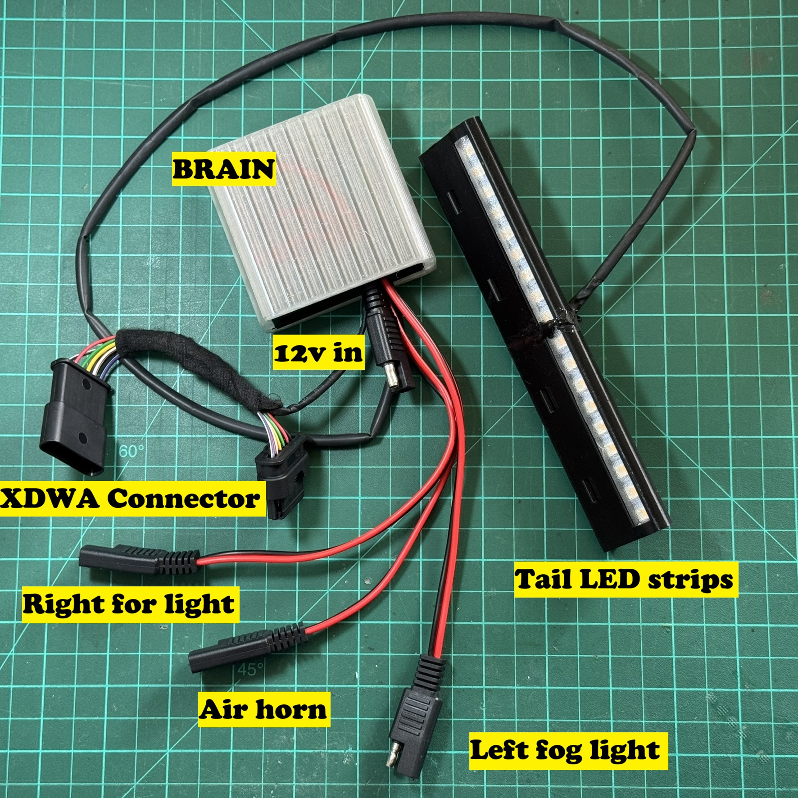

# BMW R1300GS Smart Backlight & Fog Light Controller

A fully custom, CAN-bus-integrated lighting controller for the BMW R1300GS motorcycle. Reads factory CAN bus signals directly from the XDWA connector to control rear LED strips, fog lights, and an air horn — no wire cutting or relay splicing into the original harness.



---

## ✨ Features

- **Wave-style sequential turn signals** — 9× SK6812 RGBW LEDs per side, filling left-to-right/right-to-left in sequence
- **Brake light** — first 3 LEDs on each strip dim red at idle, full bright red when braking
- **Fog light control** — left and right fog lights via MOSFET switches, auto-enable 10 seconds after engine start
- **Fog turn-signal blink** — fog lights blink in sync with the active turn signal
- **Emergency strobe** — triple-press the high-beam flash to trigger a 5-second full strobe on both fog lights
- **Air horn output** — third MOSFET reserved for future air horn
- **Knight Rider startup animation** — red sweep across all 18 LEDs on boot
- **Serial diagnostics** — 2-second heartbeat report via USB: CAN bus health, error counters, state summary
- **CAN bus isolated** — uses SN65HVD230 transceiver; reads-only, never writes to the bus

---

## 🧰 Bill of Materials

| # | Component | Notes |
|---|-----------|-------|
| 1 | Arduino Nano ESP32 | Main controller |
| 1 | SN65HVD230 CAN Bus Transceiver | 3.3V logic, connects to XDWA |
| 1 | 872-861-501 6P OBD Connector (BMW/VW/MB) | Plugs into R1300GS XDWA port |
| 1 | DC-DC Buck Converter 5V–30V → 5V 3A | Powers Arduino + LEDs from 12V bike battery |
| 3 | LR7843 Isolated MOSFET Module (HW-532B) | Fog light left, fog light right, air horn |
| 18 | SK6812 RGBW LED (addressable) | 9 per side, rear tail/turn strip |
| 1 | Silicone Wire 22 AWG | All signal and power wiring |
| 3 | 3D Printed Parts | BackLightBody, BackLightRod, BackLightScreen |

---

## 📐 Wiring Diagram

### System Overview

```
BMW R1300GS XDWA Connector          Controller Box
  │
  ├── Pin 2  (Ground) ─────────────► Common GND (Buck IN– / Arduino GND / SN65HVD230 GND)
  ├── Pin 3  (12V ACC) ────────────► DC-DC Buck Converter IN+
  ├── Pin 4  (CAN Low) ────────────► SN65HVD230 CANL
  └── Pin 5  (CAN High) ───────────► SN65HVD230 CANH
                                          │
                              SN65HVD230 TX/RX
                                          │
                                    Arduino Nano ESP32  ◄── Buck OUT+ 5V
                                          │
                        ┌─────────────────┼─────────────────┐
                        ▼                 ▼                  ▼
                  MOSFET #1          MOSFET #2          MOSFET #3
                  Fog Light LEFT     Fog Light RIGHT     Air Horn
                        │                 │
                        ▼                 ▼
                   Fog Light L       Fog Light R
                                          
            ┌─────────────────────────────────┐
            ▼                                 ▼
     LED Strip LEFT                   LED Strip RIGHT
     (9× SK6812 RGBW)                (9× SK6812 RGBW)
     D3 / GPIO_6                     D5 / GPIO_8
```

### Arduino Nano ESP32 Pin Assignment

| Arduino Pin | GPIO | Connected To |
|-------------|------|-------------|
| D4 | GPIO_7 | SN65HVD230 TX (CAN TX) |
| D6 | GPIO_9 | SN65HVD230 RX (CAN RX) |
| A1 | GPIO_2 | MOSFET #1 — Fog Light RIGHT (PWM in) |
| A5 | GPIO_3 | MOSFET #2 — Fog Light LEFT (PWM in) |
| A3 | GPIO_4 | MOSFET #3 — Air Horn (PWM in) |
| D3 | GPIO_6 | SK6812 Data — LEFT strip |
| D5 | GPIO_8 | SK6812 Data — RIGHT strip |

### MOSFET Module Wiring (each of 3 modules)

| MOSFET Terminal | Connect To |
|-----------------|-----------|
| **PWM** (signal) | Arduino output pin (see table above) |
| **GND** (signal) | Arduino GND |
| **+** (load) | Motorcycle 12V positive |
| **LOAD** | Fog light / horn positive wire |
| **–** (load) | Motorcycle chassis ground |

> The fog light / horn negative wire also connects to chassis ground directly.
> Signal GND and Load GND are **isolated** by the onboard optocoupler — this is intentional.

### XDWA Connector Pinout (BMW R1300GS)

The 6P XDWA connector is the only connection needed to the bike. Use the 872-861-501 mating connector.

| Pin | Signal | Voltage | Used |
|-----|--------|---------|------|
| 1 | 12V Constant | 12V | — (not used) |
| 2 | Ground | 0V | ✅ Common ground |
| 3 | 12V ACC (after ignition switch) | 12V | ✅ Power input |
| 4 | CAN Low | ~2.7V | ✅ CAN bus |
| 5 | CAN High | ~2.3V | ✅ CAN bus |
| 6 | Empty | — | — |

> ⚠️ Note: CAN High/Low voltages on this bike are inverted from typical convention (High ~2.3V, Low ~2.7V). If you see no CAN traffic, try swapping CANH/CANL wires first.

### XDWA → Controller Connections (as wired)

| XDWA Pin | Signal | Connect To |
|----------|--------|-----------|
| Pin 2 | Ground | DC-DC Buck IN– **and** Arduino GND **and** SN65HVD230 GND |
| Pin 3 | 12V ACC | DC-DC Buck IN+ |
| Pin 4 | CAN Low | SN65HVD230 CANL |
| Pin 5 | CAN High | SN65HVD230 CANH |

### SN65HVD230 CAN Transceiver Wiring

| Transceiver Pin | Connect To |
|-----------------|-----------|
| VCC | Arduino 3.3V output |
| GND | XDWA Pin 2 (common ground) |
| TX | Arduino D4 (GPIO_7) |
| RX | Arduino D6 (GPIO_9) |
| CANH | XDWA Pin 5 |
| CANL | XDWA Pin 4 |

> The SN65HVD230 runs at 3.3V logic and is directly compatible with the ESP32. Power it from the Arduino's **3.3V output pin**, not from the buck converter.
> Do **not** add a 120Ω termination resistor — the bike's bus is already terminated. If you see RX errors, try swapping CANH/CANL or adding one and see if it improves.

### DC-DC Buck Converter Wiring

| Buck Converter | Connect To |
|----------------|-----------|
| IN+ | XDWA Pin 3 (12V ACC) |
| IN– | XDWA Pin 2 (Ground) |
| OUT+ (5V) | Arduino 5V pin + SK6812 strip 5V power |
| OUT– | Arduino GND + SK6812 strip GND |

> Set the output to **5V** before connecting anything. The SK6812 strips and Arduino Nano ESP32 both run on 5V.
> Using ACC (Pin 3) means the controller powers on with the ignition — no need for a separate switch.

---

## 📡 CAN Bus Messages (BMW R1300GS)

These CAN IDs were identified on the R1300GS XDWA connector at **500 kbps**.

| CAN ID | Purpose | Relevant Byte/Bit |
|--------|---------|-------------------|
| `0x3FA` | Engine state | Byte 5 > 0 = engine running |
| `0x2D0` | High beam flash | Byte 6, bit 4 = 0 when flashed |
| `0x2D2` | Switches | Byte 0, bit 2 = Left signal |
| | | Byte 0, bit 3 = Right signal |
| | | Byte 0, bit 5 = Brake |

> ⚠️ These IDs were reverse-engineered on a specific R1300GS. Confirm with a CAN scanner on your own bike before trusting them. They may vary by model year or spec.

---

## 💡 LED Strip Layout

Each side has **9× SK6812 RGBW LEDs**, indexed 0–8:

```
[ 0 ][ 1 ][ 2 ] — Tail / Brake LEDs (always on)
[ 3 ][ 4 ][ 5 ][ 6 ][ 7 ][ 8 ] — Turn Signal LEDs (Wave sequential)
```

**Tail mode:** dim red `(60, 0, 0, 0)`  
**Brake mode:** full red `(255, 0, 0, 0)`  
**Turn signal:** amber sequential fill `(255, 50, 0, 0)`, 80ms per step, 160ms hold, 320ms pause

---

## 🔆 Fog Light Behavior

| Condition | Fog Light State |
|-----------|----------------|
| Engine off | OFF |
| Engine on < 10 seconds | OFF (startup delay) |
| Engine on ≥ 10 seconds | ON |
| Engine on + turn signal active | Blink at 800ms cycle |
| Triple high-beam flash | 5-second strobe (10Hz) on both fogs |

---

## 🖨️ 3D Printed Parts

All STL files are in the `/STL` folder.

| File | Description |
|------|-------------|
| `BackLightBody.stl` | Main housing body |
| `BackLightRod.stl` | Mounting rod / arm |
| `BackLightScreen.stl` | LED diffuser screen |

Print recommendations: PETG or ASA for outdoor/UV resistance. 20–30% infill. No supports needed for Body and Screen; Rod may need supports depending on orientation.

---

## 🛠️ Software Setup

### Dependencies

Install via Arduino Library Manager or PlatformIO:

- [`Adafruit NeoPixel`](https://github.com/adafruit/Adafruit_NeoPixel)
- ESP32 Arduino Core (includes `driver/twai.h` — no separate install needed)

### Board Setup

1. Install **Arduino ESP32 core** in Arduino IDE (Board Manager → search "esp32" by Espressif)
2. Select board: **Arduino Nano ESP32**
3. Upload `EasierCan.ino.ino`

### First Boot

Open Serial Monitor at **115200 baud**. You will see:

```
========================================
  BMW R1300GS CONTROLLER - DIAGNOSTICS
========================================
Initializing CAN Driver... SUCCESS! Driver Running.
```

Every 2 seconds a diagnostic report prints showing CAN message count, error counters, and current state. If `CAN Messages Received: 0` appears, check wiring and ensure ignition is ON.

---

## 🔒 Safety Notes

- This device **reads** CAN bus only — it never transmits. It cannot interfere with bike ECU operation.
- Always fuse the 12V input line (suggest 5A inline fuse).
- The LR7843 MOSFET modules support up to 15A continuous — more than enough for fog lights and a horn.
- Test all connections on the bench before installing on the bike.
- The fog lights auto-enable 10 seconds after engine start. Ensure fog lights are properly mounted before first test.

---

## 📁 Repository Structure

```
/
├── EasierCan.ino.ino          # Main Arduino sketch
├── README.md              # This file
├── STL/
│   ├── BackLightBody.stl
│   ├── BackLightRod.stl
│   └── BackLightScreen.stl
└── docs/
    └── images/
```

---

## 📜 License

MIT License — free to use, modify, and share. Credit appreciated!

---

## 🙏 Contributing

Found a different CAN ID on your R1300GS? Discovered a bug? PRs and Issues are welcome!
